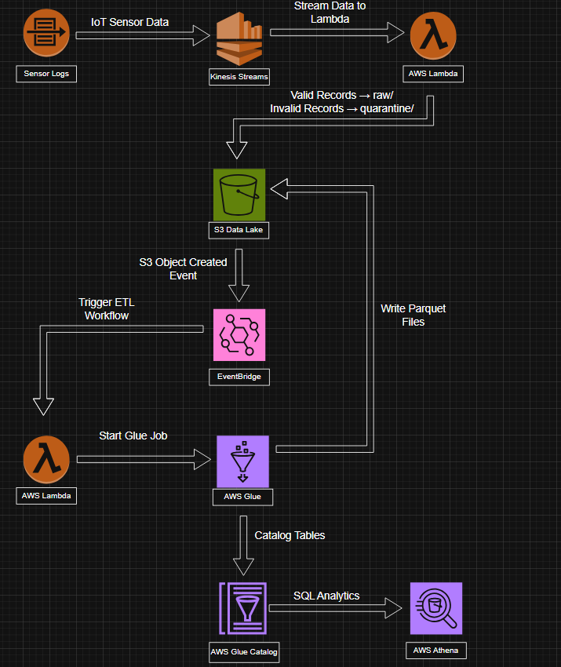

# Smart Manufacturing Data Intelligence Platform

A real-time AWS data engineering project that ingests IoT sensor data using Amazon Kinesis, validates records with AWS Lambda, processes data using AWS Glue, and enables serverless analytics using Amazon Athena.

## Architecture



---

## Tech Stack

- Amazon Kinesis Data Streams
- AWS Lambda
- Amazon S3
- Amazon EventBridge
- AWS Glue
- AWS Glue Crawler
- AWS Glue Data Catalog
- Amazon Athena
- AWS IAM

---

## Project Structure

```text
Smart-Manufacturing-Data-Intelligence-Platform/
│
├── Architecture.png
├── Producer.py
├── sensor_validator.py
├── start_glue_job.py
├── manufacturing_etl.py
└── README.md
```

---

## Implementation Guide

### Step 1: Create Data Lake

Create an S3 bucket and the following folders:

```text
raw/
processed/
quarantine/
```

---

### Step 2: Create Kinesis Stream

Create:

```text
MachineSensorStream
```

Purpose:

- Receive manufacturing sensor data in real time.

---

### Step 3: Deploy Producer

File:

```text
Producer.py
```

Purpose:

- Generate sensor data
- Push records to Kinesis


Run:

```bash
python Producer.py
```

---

### Step 4: Deploy Validation Lambda

File:

```text
sensor_validator.py
```

Lambda:

```text
sensor-validator
```

Trigger:

```text
MachineSensorStream
```

Purpose:

- Validate records
- Store valid records in raw/
- Store invalid records in quarantine/


Required Fields:

```python
[
    "machine_id",
    "temperature",
    "vibration",
    "power_usage",
    "timestamp"
]
```

---

### Step 5: Deploy ETL Trigger Lambda

File:

```text
start_glue_job.py
```

Lambda:

```text
start-glue-job
```

Purpose:

- Receive EventBridge events
- Start Glue ETL automatically

---

### Step 6: Create Glue ETL Job

File:

```text
manufacturing_etl.py
```

Glue Job:

```text
manufacturing-etl
```

Purpose:

- Read JSON files from raw/
- Convert JSON to Parquet
- Store output in processed/

---

### Step 7: Configure EventBridge

Event Source:

```text
Amazon S3
```

Event:

```text
Object Created
```

Target:

```text
start-glue-job
```

---

### Step 8: Create Glue Crawler

Crawler:

```text
manufacturing-processed-crawler
```

Source:

```text
s3://<bucket-name>/processed/
```

Purpose:

- Discover schema
- Update Data Catalog


---

### Step 9: Create Athena Database

```sql
CREATE DATABASE manufacturing_db;
```

Purpose:

- Query processed manufacturing data

---

### Step 10: Execute Pipeline

End-to-End Flow:

```text
Producer
    ↓
Kinesis
    ↓
sensor-validator
    ↓
raw/
    ↓
EventBridge
    ↓
start-glue-job
    ↓
manufacturing-etl
    ↓
processed/
    ↓
Glue Crawler
    ↓
Glue Data Catalog
    ↓
Athena
```

---

## Data Lake Layers

### Raw Zone

Stores validated incoming sensor records.

```text
raw/
```

### Processed Zone

Stores transformed Parquet datasets generated by AWS Glue.

```text
processed/
```

### Quarantine Zone

Stores invalid records detected during validation.

```text
quarantine/
```

---

## Sample Athena Query

```sql
SELECT
    machine_id,
    AVG(temperature) AS avg_temperature,
    AVG(vibration) AS avg_vibration,
    AVG(power_usage) AS avg_power_usage
FROM processed
GROUP BY machine_id;
```

---

## Features

- Real-time streaming ingestion
- Data validation using Lambda
- Automatic quarantine handling
- Event-driven ETL processing
- JSON to Parquet conversion
- Schema evolution support
- Athena analytics
- CloudWatch monitoring
- IAM governance
- Cost optimization using S3 Lifecycle Policies

---
